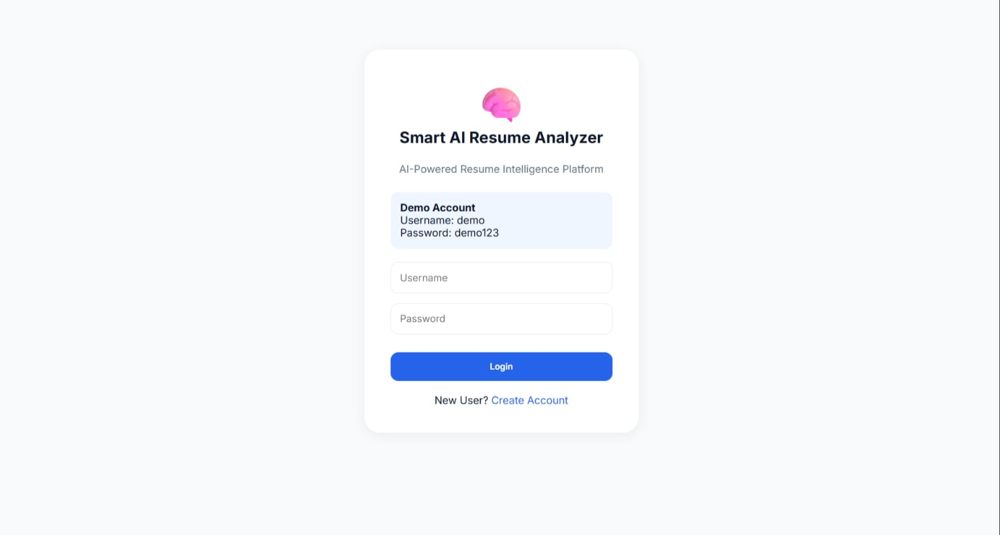
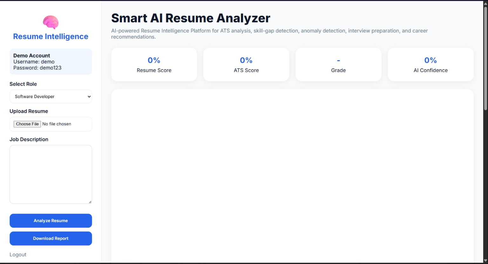
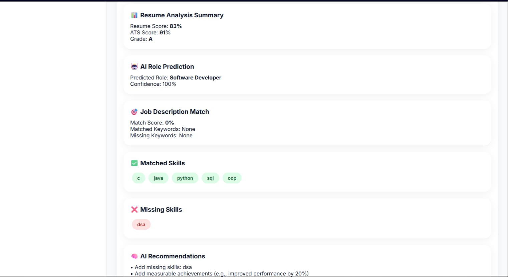
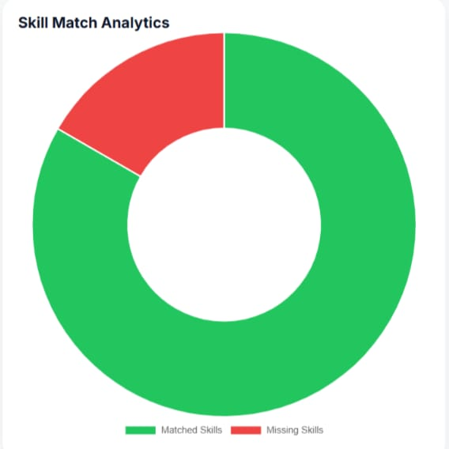
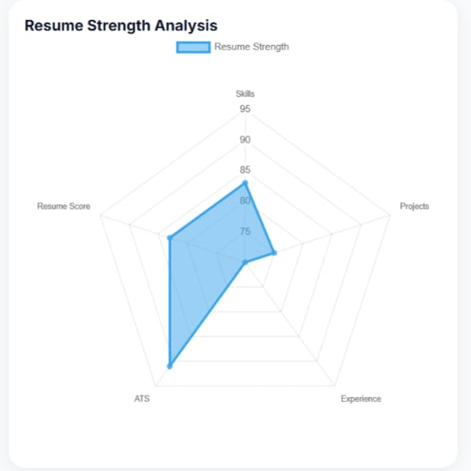

# 🧠 Smart AI Resume Analyzer

### AI-Powered Resume Intelligence Platform

Smart AI Resume Analyzer is a full-stack AI-powered web application designed to evaluate resumes using ATS (Applicant Tracking System) principles and intelligent resume analysis techniques. The platform helps students and job seekers improve their resumes through automated scoring, skill-gap analysis, anomaly detection, interview preparation assistance, and personalized recommendations.

🌐 **Live Demo:** https://smart-ai-resume-analyzer-u8ip.onrender.com/login

📂 **GitHub Repository:** https://github.com/AmruthaPithani/smart-ai-resume-analyzer

> ⚠️ Note: The application is hosted on Render's free tier. The first request may take 30–60 seconds while the server wakes up.

---

# 📸 Application Screenshots

## Login Page



## AI Resume Intelligence Dashboard



## Resume Analysis Results



## Analytics Dashboard



## Resume Strength Analysis



---

# 🚀 Key Features

## 📄 Resume Processing

* Upload Resume (PDF)
* Resume Preview
* Automated PDF Text Extraction
* Resume Content Analysis

## 🎯 ATS Analysis

* ATS Compatibility Scoring
* Resume Intelligence Score
* Resume Grading System (A / B / C)
* Resume Quality Evaluation

## 🧠 AI-Powered Analysis

* Skill Matching Based on Job Role
* Missing Skill Identification
* Skill Gap Analysis
* Personalized Resume Recommendations
* Career Improvement Suggestions

## 🚨 Resume Anomaly Detection

* Missing Experience Detection
* Missing Projects Detection
* Missing Contact Information Detection
* Resume Completeness Analysis

## 🎤 Interview Preparation Assistant

* Skill-Based Interview Question Generation
* Technical Interview Preparation
* Personalized Question Recommendations

## 📊 Interactive Dashboard

* Resume Score Card
* ATS Score Card
* Grade Card
* Skill Count Analytics
* Skill Match Visualization
* Historical Performance Tracking
* Interactive Charts

## 📄 Report Generation

* Download Analysis Report as PDF
* ATS Summary
* Skill Analysis Report
* Resume Insights Report

## 🔐 Authentication System

* Secure Login & Registration
* Password Hashing
* Session Management
* Demo Account Access

---

# 🧠 AI Features

* Resume Parsing & Text Extraction
* ATS Compatibility Analysis
* Intelligent Resume Scoring
* Skill Gap Detection
* Resume Anomaly Detection
* AI-Powered Recommendations
* Automated Interview Question Generation
* Resume Performance Analytics
* Candidate Assessment Support System
* Intelligent Resume Intelligence Dashboard

---

# 🏗️ System Architecture


### Workflow

PDF Resume

⬇️

Text Extraction (PyMuPDF)

⬇️

ATS Analysis Engine

⬇️

Skill Matching Engine

⬇️

Resume Scoring System

⬇️

AI Recommendation Engine

⬇️

Interview Question Generator

⬇️

Anomaly Detection Module

⬇️

Dashboard & PDF Report Generation

---

# ⚙️ How It Works

### Step 1

Upload your resume in PDF format.

### Step 2

Select a target role:

* Software Developer
* Data Scientist
* Web Developer

### Step 3

The system extracts and processes resume content.

### Step 4

Role-specific skills are matched against the resume.

### Step 5

The platform calculates:

* Resume Score
* ATS Score
* Resume Grade

### Step 6

AI-generated recommendations and insights are generated.

### Step 7

Interview questions and anomaly detection results are displayed.

### Step 8

Users can download a detailed PDF report.

---

# 📊 Example Output

### Found Skills

* Python
* SQL
* Java

### Missing Skills

* DSA
* OOP

### Resume Metrics

* Resume Score: 82%
* ATS Score: 88%
* Grade: A

### AI Recommendations

* Add measurable achievements
* Include more role-specific keywords
* Add additional projects
* Improve ATS optimization

### Interview Questions

* Explain a project where you used Python.
* What challenges did you face while using SQL?
* How would you optimize a database query?

### Anomaly Detection

* No major issues detected.

---

# 🔑 Demo Account

Use the following credentials to explore the application:

### Username

demo

### Password

demo123

---

# 🛠️ Tech Stack

## Frontend

* HTML5
* CSS3
* JavaScript
* Chart.js

## Backend

* Flask (Python)

## Database

* SQLite

## Libraries & Tools

### PDF Processing

* PyMuPDF (fitz)

### Report Generation

* ReportLab

### Authentication

* Werkzeug Security

### Data Visualization

* Chart.js

---

# 📂 Project Structure

```text
Smart-AI-Resume-Analyzer/
│
├── app.py
├── users.db
├── requirements.txt
│
├── templates/
│   ├── index.html
│   ├── login.html
│   └── register.html
│
├── static/
│   ├── style.css
│   └── script.js
│
├── assets/
│   ├── login.png
│   ├── dashboard.png
│   ├── analysis.png
│   ├── charts.png
│   ├── report.png
│   └── architecture.png
│
└── README.md
```

---

# ⚙️ Installation

## Clone Repository

```bash
git clone https://github.com/AmruthaPithani/smart-ai-resume-analyzer.git
```

## Navigate to Project

```bash
cd smart-ai-resume-analyzer
```

## Install Dependencies

```bash
pip install -r requirements.txt
```

## Run Application

```bash
python app.py
```

## Open Browser

```text
http://127.0.0.1:5000
```

---

# 🌐 Deployment

The application is deployed using Render.

### Build Command

```bash
pip install -r requirements.txt
```

### Start Command

```bash
gunicorn app:app
```

---

# 🎯 Use Cases

* Resume Evaluation for Students
* Internship Preparation
* Placement Preparation
* ATS Optimization
* Career Guidance Systems
* Skill Gap Identification
* Candidate Assessment Platforms
* Interview Readiness Evaluation

---

# 🔮 Future Enhancements

* Semantic Resume Matching using Sentence Transformers
* Real Generative AI Integration (OpenAI/Gemini)
* Job Description Matching
* Resume Ranking System
* Multi-Resume Comparison
* Recruiter Dashboard
* Cloud Database Integration
* Personalized Learning Recommendations
* Mobile Application Support

---

# 📈 Project Highlights

✅ Full-Stack Web Application

✅ AI-Powered Resume Intelligence Platform

✅ ATS Analysis Engine

✅ Skill Gap Detection

✅ Resume Anomaly Detection

✅ Interview Question Generator

✅ Interactive Analytics Dashboard

✅ Secure Authentication System

✅ PDF Report Generation

✅ Cloud Deployment Ready

---

# 👩‍💻 Author

## Amrutha Pithani

B.Tech Student | AI & Software Development Enthusiast

GitHub: https://github.com/AmruthaPithani

---

### ⭐ If you found this project useful, consider giving it a star on GitHub!
